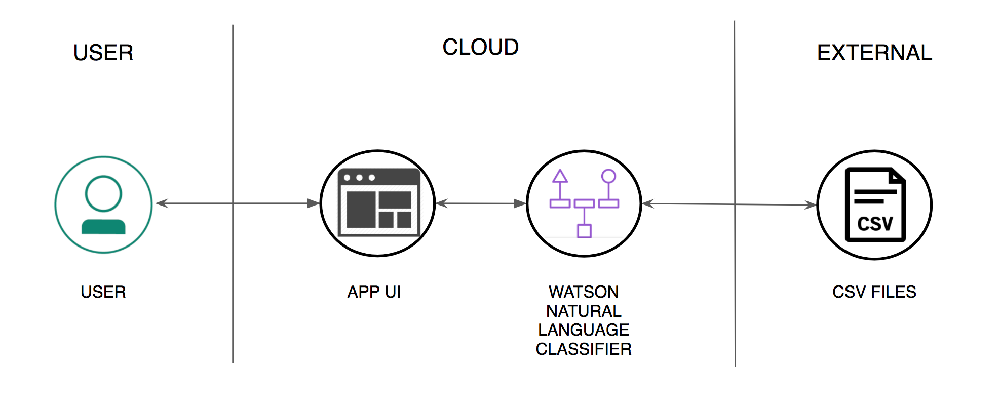

> **DISCLAIMER**: This application is used for demonstrative and illustrative purposes only and does not constitute an offering that has gone through regulatory review. It is not intended to serve as a medical application. There is no representation as to the accuracy of the output of this application and it is presented without warranty.

# Classify E-Commerce product descriptions

This application was built to demonstrate IBM's Watson Natural Language Classifier (NLC). The data set we will be using, made by cleaning and combining the [flipkart](https://www.kaggle.com/PromptCloudHQ/flipkart-products) and [JCPenny](https://www.kaggle.com/PromptCloudHQ/all-jc-penny-products/data) datasets made available through [Kaggle](https://www.kaggle.com), contains product descriptions and category labels.  One of the biggest advantages of stores operating online rather than as a brick-and-mortar has been the efficiency of removing physical inventory and labor.  Utilizing Watson NLC allows an online marketplace to further automate their inventory management and cataloging system by classifying products based on their description.  Just like with brick-and-mortar stores, online stores need to display their products in the correct section of their stores to ensure ease of use by consumers.  Watson Natural Language Classification allows this to be done both at high levels of confidence and on a continual basis.

For demonstration, the app accepts both raw text descriptions as well as urls from product offered by [Kohl's](https://www.kohls.com/) where it extracts the product descrption. [Kohl's](https://www.kohls.com/) was chosen because the nature of products are similar to products on [Flipkart](https://www.flipkart.com/) and [JCPenny](https://www.jcpenney.com/), which were used in training.  Although the products themselves are similar, there are many nuanced differences in word choice and usage.  These differences in natural language, while not noticed by human interpreters, has in the past been a huge issue in automated approached to analysis.  Watson's ability to understand and analyze the meanings of words, as opposed to simply memorizing them, is what sets its capabilities apart from other machine learning tools.

This application is a Python web application based on the [Flask microframework](http://flask.pocoo.org/), and based on earlier work done by [Ryan Anderson](https://github.com/rustyoldrake/IBM_Watson_NLC_ICD10_Health_Codes). It uses the [Watson Python SDK](https://github.com/watson-developer-cloud/python-sdk) to create the classifier, list classifiers, and classify the input text. 

[](https://github.com/erichensleyibm/NLC_product_classifier-demo)

## Architecture



## Setup the classifier

Here we create the classifier with our product description dataset.

1. Download the [product description training dataset](https://github.com/erichensleyibm/NLC_product_classifier-demo/tree/master/data) by right clicking the link and selecting _Save As_.
1. Create an [NLC service in IBM Cloud](https://console.bluemix.net/catalog/services/natural-language-classifier), make a note of the service name used in the catalog, we'll need this later.
1. Create service credentials by using the menu on the left and selecting the default options.
1. Upload the data using the command below. Be sure to substitute the username and password. This will take around 3 hours.

```bash
curl -i --user "$username":"$password" -F training_data=@ICD-10-GT-AA.csv -F training_metadata="{\"language\":\"en\",\"name\":\"product_description_classifier\"}" "https://gateway.watsonplatform.net/natural-language-classifier/api/v1/classifiers"
````

## Running the application

This application can be run locally or hosted on IBM Cloud, follow the steps below depending on your deployment choice

### Run locally

1. Clone this project: `git clone git@github.com:erichensleyibm/NLC_product_classifier-demo.git`
1. `cd` into this project's root directory
1. (Optionally) create a virtual environment: `virtualenv my-nlc-demo`
    1. Activate the virtual environment: `./my-nlc-demo/bin/activate`
1. Run `pip install -r requirements.txt` to install the app's dependencies
1. Update the [welcome.py](welcome.py) with your NLC credentials
1. Run `python welcome.py`
1. Access the running app in a browser at `http://localhost:5000`

### Run on IBM Cloud

1. Clone this project: `git clone git@github.com:erichensleyibm/NLC_product_classifier-demo.git`
1. `cd` into this project's root directory
1. Update [`manifest.yml`](manifest.yml) with the NLC service name (`your_nlc_service_name`), a unique application name (`your_app_name`) and unique host value (`your_app_host`)

    ```
    applications:
      - path: .
      memory: 256M
      instances: 1
      domain: mybluemix.net
      name: your_app_name
      host: your_app_host
      disk_quota: 1024M
      services:
      - your_nlc_service_name
      buildpack: python_buildpack
    ```

1. Run `bluemix app push` from the root directory
1. Access the running app by going to: `https://<host-value>.mybluemix.net/`

> If you've never run the `bluemix` command before there is some configuration required, refer to the official [IBM Cloud CLI](https://console.bluemix.net/docs/cli/reference/bluemix_cli/get_started.html) docs to get this set up.

# Links
* [Watson NLC API](https://www.ibm.com/watson/developercloud/natural-language-classifier/api/v1/)
* [Watson Python SDK](https://github.com/watson-developer-cloud/python-sdk)
* [IBM Cloud CLI](https://console.bluemix.net/docs/cli/reference/bluemix_cli/get_started.html)
* [Watson Natural Language Classifier](https://www.ibm.com/watson/services/natural-language-classifier/)
* [Ryan Anderson's Original Work](https://github.com/rustyoldrake/IBM_Watson_NLC_ICD10_Health_Codes)

# License

[Apache 2.0](LICENSE)
